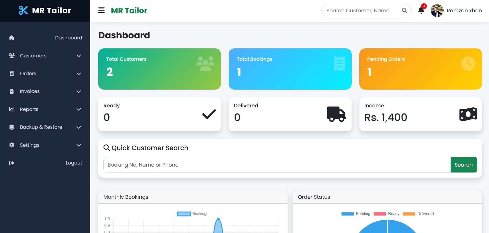
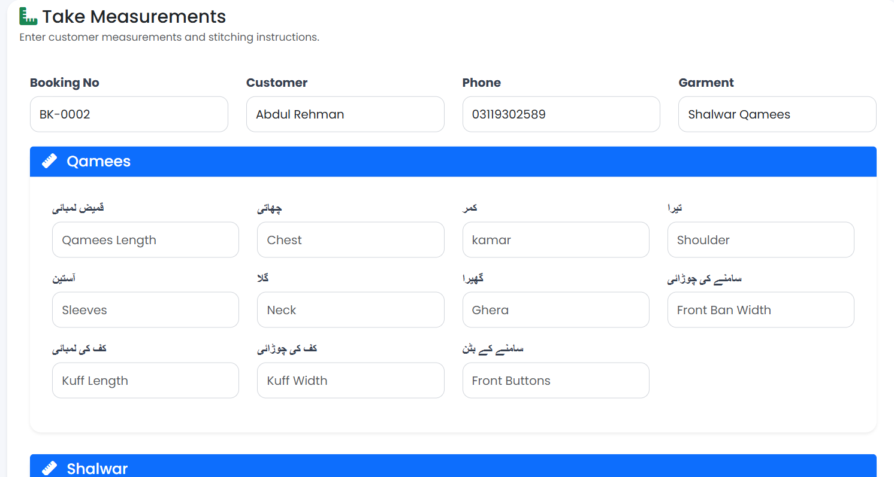
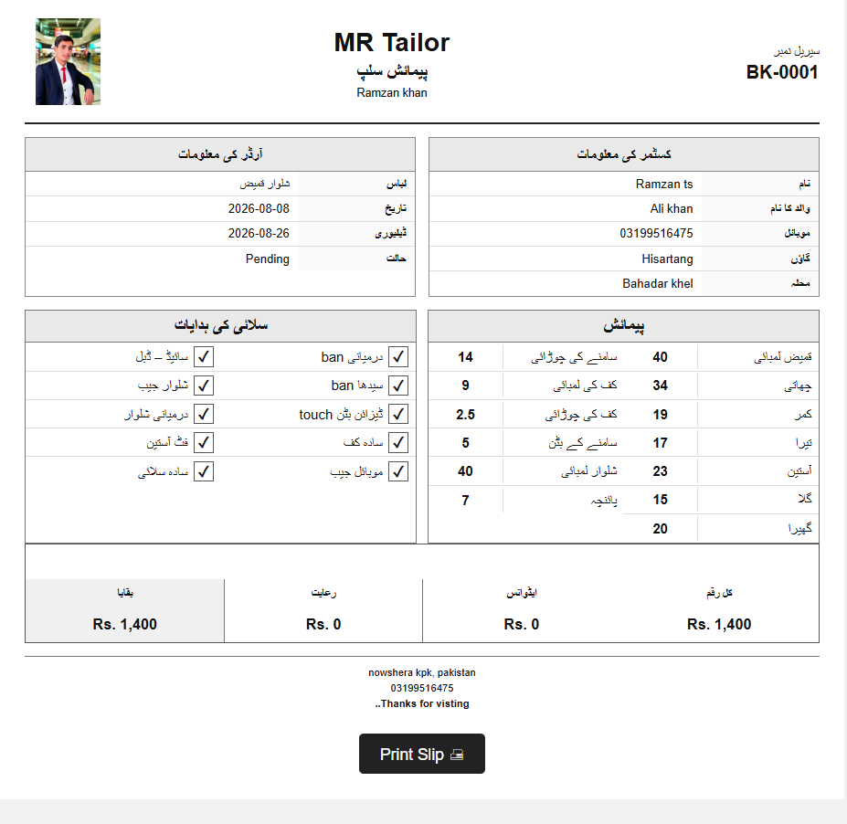
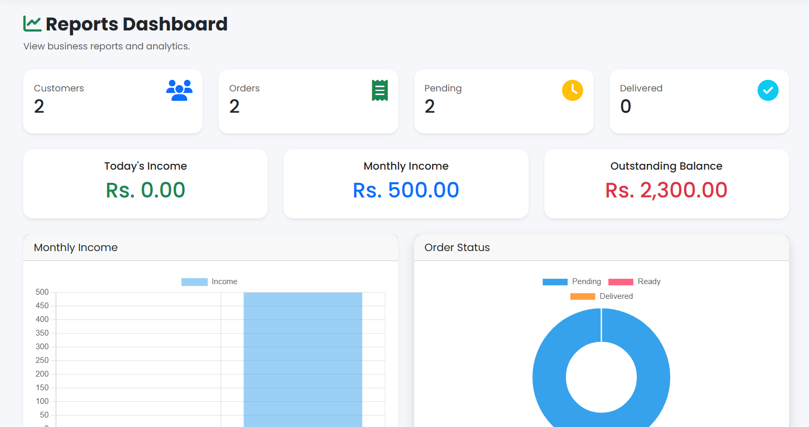

# 🧵 MR Tailor — Tailor Management System

> A full-stack web-based management system designed to digitize and simplify the daily operations of a tailoring business.

## 📌 Overview

MR Tailor is a tailor management system developed to manage customers, bookings, measurements, garments, stitching options, and orders from a centralized platform.

The project was designed around a real-world tailoring workflow rather than a simple demonstration CRUD application.

## ✨ Features

### 👤 Customer Management
- Add customers
- Update customer information
- Search customers
- Manage customer details

### 📋 Booking & Order Management
- Create bookings
- Track order status
- Manage pending, ready, and delivered orders
- View customer order history

### 📏 Measurement Management
- Store customer measurements
- Support different garment types
- Manage measurement types dynamically
- Organize measurements for individual orders

### 👕 Garment Type Management
- Store garment types in the database
- Support English and Urdu garment names
- Activate/deactivate garment types

### 🧵 Stitching Options
- Manage stitching options
- Categorize stitching options
- Store printable ordering information

### 📊 Dashboard
- Total customers
- Total bookings
- Pending orders
- Ready orders
- Delivered orders
- Income overview

### 🧾 Measurement Receipt
- Search customer/order
- Display measurement information
- Generate a printable measurement receipt

---

## 🛠️ Technologies

| Technology | Purpose |
|---|---|
| PHP | Backend development |
| MySQL | Database |
| JavaScript | Client-side functionality |
| HTML5 | Structure |
| CSS3 | Styling |
| Bootstrap | Responsive UI |
| MVC Architecture | Application architecture |
| Git & GitHub | Version control |

---

## 🏗️ Architecture

The application follows the **MVC (Model-View-Controller)** architecture.

```text
MR Tailor
│
├── Models
│   └── Database & Business Logic
│
├── Views
│   └── User Interface
│
├── Controllers
│   └── Request & Application Flow
│
├── Public
│   ├── CSS
│   ├── JavaScript
│   └── Assets
│
└── Database
    ├── Customers
    ├── Orders
    ├── Measurements
    ├── Garment Types
    └── Stitching Options


                    MR TAILOR
                       │
          ┌────────────┼────────────┐
          │            │            │
       Model       Controller      View
          │            │            │
          └────────────┼────────────┘
                       │
                    MySQL
```
---
Customer Management
        ↓
Booking / Order
        ↓
Garment Type
        ↓
Measurement Types
        ↓
Measurements
        ↓
Stitching Options
        ↓
Order Tracking
        ↓
Printable Receipt
---
## 💡 Why I Built This Project

Traditional tailoring businesses often rely on handwritten records for customer
information, measurements, bookings, and order tracking.

I built MR Tailor to convert this manual workflow into a centralized digital
management system that makes customer information, measurements, garment types,
stitching options, and orders easier to manage and retrieve.
---


---

# 7. Database

Since you've spent significant effort designing the database, **show it**.

```markdown
## 🗄️ Database

The system uses MySQL as the primary database.

Major database components include:

- Customers
- Orders
- Measurements
- Measurement Types
- Garment Types
- Stitching Options

The database-driven design allows garment types, measurement types,
and stitching options to be managed dynamically instead of being hardcoded.
```

---## 📸 Screenshots

### Dashboard


### Customer Management


### Measurement Management


### Garment Type Management


### Order Management


### Measurement Receipt

### Reports & Analytics


---

## 🚀 Installation

### Requirements

- PHP 8+
- MySQL
- Apache
- Git
- XAMPP or Laragon

### 1. Clone the repository

```bash
git clone https://github.com/codewithramzan/mr-tailor-management-system.git
2. Move into your web server directory

For Laragon:

C:/laragon/www/

For XAMPP:

C:/xampp/htdocs/
3. Create the database

Create a MySQL database:

tailor_management
4. Import the database

Import the project's SQL file into the database.

5. Configure the database connection

Update the database configuration according to your local environment.

6. Run the application

Start Apache and MySQL, then open the project through your local server.

# 10. Project Goals

Keep this short:

```markdown
## 🎯 Project Goals

- Digitize traditional tailoring workflows
- Reduce manual record keeping
- Organize customer measurements
- Improve order tracking
- Make customer information easier to retrieve
- Provide a scalable foundation for future features

## 🔮 Future Improvements

- Role-based authentication
- Advanced sales and expense reporting
- SMS/WhatsApp order notifications
- Online customer booking
- REST API
- Cloud deployment
- Mobile application
- Automated backup system
```
## 👨‍💻 Developer

### Ramzan Khan

Full-Stack Developer | Computer Science Student | Future AI Engineer

GitHub: [@codewithramzan](https://github.com/codewithramzan)

---

⭐ If you find this project useful, consider giving the repository a star.
